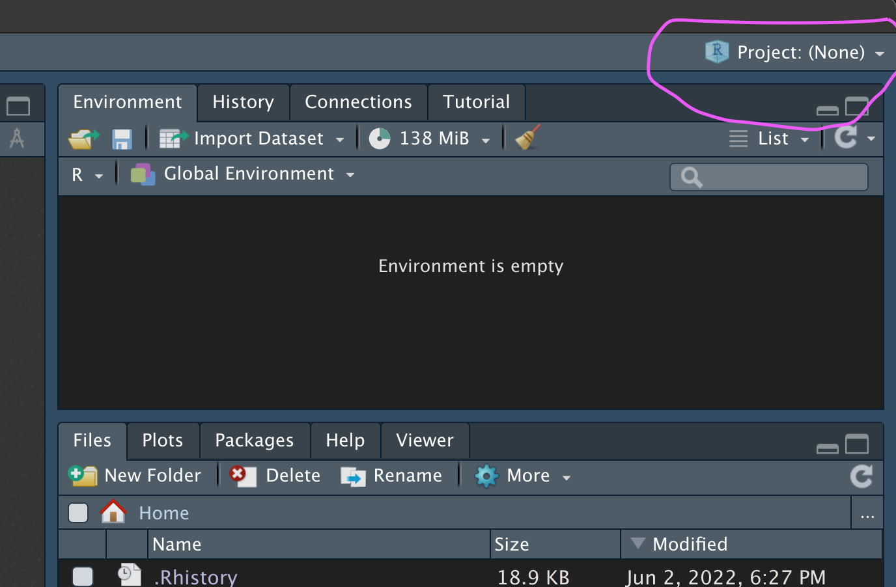
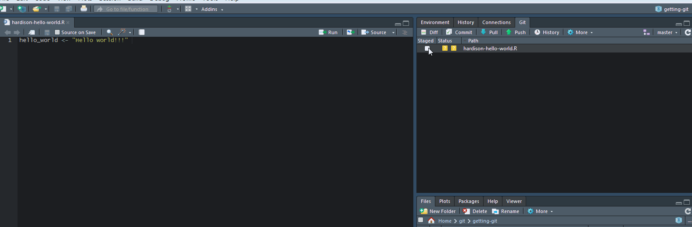
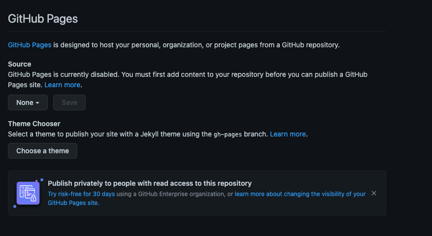

```{r setup, echo = F}
image.dir <- "images"

options(htmltools.dir.version = FALSE)
knitr::opts_chunk$set(echo = F,
                      warning = F,
                      message = F)
```

# Today's workshop

.pull-left[
* Version control systems + Git

* Concepts in Git

* Integration with Github

* Create, collaborate, and share

]

.pull-right[
**Source material**

```{r progit, out.width = "80%", fig.align = "center"}
knitr::include_graphics("images/progit.png")
```

]

.footnote[
Chacon, Scott, and Ben Straub. Pro git. Apress, 2014.
]

---
## Why use Github and Git?


.pull-left[
* **Improves reproducibility and transparency:** great for manuscripts but also day-to-day science-ing
]

.pull-right[
```{r, out.width="100%", fig.align="center", fig.cap="Git + Github = Distributed Version Control System"}
knitr::include_graphics(file.path(image.dir,"DVCS.png"))
```
]

---
## Why use Github and Git?
.pull-left[
* **Improves reproducibility and transparency:** great for manuscripts but also day-to-day science-ing


* **Ease of collaboration:** with the right tools, any collaborator should be able to run your code (and build on it) 
]

.pull-right[
```{r, out.width="100%", fig.align="center", fig.cap="Git + Github = Distributed Version Control System"}
knitr::include_graphics(file.path(image.dir,"DVCS.png"))
```
]

---
## Why use Github and Git?
.pull-left[
* **Improves reproducibility and transparency:** great for manuscripts but also day-to-day science-ing

* **Ease of collaboration:** with the right tools, any collaborator should be able to run your code (and build on it) 

* **Communicating your work:** Build and share apps and websites easily with Github Pages 
]

.pull-right[
```{r, out.width="100%", fig.align="center", fig.cap="Git + Github = Distributed Version Control System"}
knitr::include_graphics(file.path(image.dir,"DVCS.png"))
```
]

---
## Why use Github and Git?
.pull-left[
* **Improves reproducibility and transparency:** great for manuscripts but also day-to-day science-ing

* **Ease of collaboration:** with the right tools, any collaborator should be able to run your code (and build on it) 

* **Communicating your work:** Build and share apps and websites easily with Github Pages

* **Never lose your work**
]

.pull-right[
```{r, out.width="100%", fig.align="center", fig.cap="Git + Github = Distributed Version Control System"}
knitr::include_graphics(file.path(image.dir,"DVCS.png"))
```
]

---

## Your friendly neighborhood Version Control System 1:

.pull-left[
**Local Version Control:**  

* Developed to avoid this: "hardison_v2_2_2022_06_02a_edited.csv"
]

.pull-right[

```{r}
knitr::include_graphics(file.path(image.dir,"LVCS.png"))
```

]
---

## Your friendly neighborhood Version Control System 1:

.pull-left[
**Local Version Control:** 

* Developed to avoid this: "hardison_v2_2_2022_06_02a_edited.csv"
  
* An offline database that keeps track of changes to files in a folder ("patches")
]

.pull-right[

```{r}
knitr::include_graphics(file.path(image.dir,"LVCS.png"))
```

]
---

## Your friendly neighborhood Version Control System 1:

.pull-left[
**Local Version Control:** 

* Developed to avoid this: "hardison_v2_2_2022_06_02a_edited.csv"
  
* An offline database that keeps track of changes to files in a folder ("patches")
  
* Patches can be added and subtracted to revert documents to previous states

]

.pull-right[

```{r}
knitr::include_graphics(file.path(image.dir,"LVCS.png"))
```

]
---
  
## Your friendly neighborhood Version Control System 2:

.pull-left[
**Centralized Version Control:** 

* Allows collaboration between systems
]

.pull-right[

```{r}
knitr::include_graphics(file.path(image.dir,"CVCS.png"))
```

]
---

## Your friendly neighborhood Version Control System 2:

.pull-left[
**Centralized Version Control:** 

* Allows collaboration between systems

* **Individual** files can be **checked out** from central server hosting database of file patches
]

.pull-right[

```{r}
knitr::include_graphics(file.path(image.dir,"CVCS.png"))
```

]
---

## Your friendly neighborhood Version Control System 3:

.pull-left[
**Distributed Version Control:** 

* Users **check out** copies of full directories rather than individual files
]

.pull-right[

```{r}
knitr::include_graphics(file.path(image.dir,"DVCS.png"))
```

]
---

## Your friendly neighborhood Version Control System 3:

.pull-left[
**Distributed Version Control:** 

* Users **check out** copies of full directories rather than individual files

* These directories, or **repositories**, include the full history of each file
 
]

.pull-right[

```{r}
knitr::include_graphics(file.path(image.dir,"DVCS.png"))
```

] 
---

## Your friendly neighborhood Version Control System 3:

.pull-left[
**Distributed Version Control:** 

* Users **check out** copies of full directories rather than individual files

* These directories, or **repositories**, include the full history of each file

* In short: everyone has the database of patches 
 
]

.pull-right[

```{r}
knitr::include_graphics(file.path(image.dir,"DVCS.png"))
```

] 

---

## Distributed Version Control Systems

* Distributed Version Control:

  * A copy you create of a remote repository is called a **clone**

.center[

]

* **Git** is a distributed version control software

---


**Things to know**

* **Repository:** A file directory that is being tracked by **Git**
  
  * Also called a "repo"

--

* **Clone:** An exact copy of a repository containing the full history of project changes

--

**Terminal commands:**

Print current directory
  .remark-inline-code[
    `pwd`
  ]

Change current directory (to /desktop here)
  .remark-inline-code[
  `cd /users/seanhardison/desktop`
  ]


---
## How does Git work?

* Git stores information about the state of all files in the repository (think repo "**snapshots**")

```{r snapshots, out.width = "80%", fig.align = "center"}
knitr::include_graphics(file.path(image.dir,"git-snapshots.png"))
```

--

* Files that have not been changed are not replicated, but linked to

* All information is **local**, and all operations can be performed offline


???
When a snapshot is taken, a file is assigned an id specific to the checksum, or hash. No further changes can be made to that file without Git first knowing about it, and so you cannot lose information.

---

## The Three File States

* Files can be in one of three states after being added to repo

    1. Staged or "added" - Files are marked for **committing** (the snapshot)
    
        * We need to tell Git which files to track
        
    <br>
    <br>
    <br>
    <br>

```{r, out.width = "60%", fig.align="center"}
knitr::include_graphics(file.path(image.dir,"file-states.png"))
```

---

## The Three File States

* Files can be in one of three states after being added to repo

    1. Staged or "added" - Files are marked for **committing** (the snapshot)
    
        * We need to tell Git which files to track

    2. Modified - A change is made after the file is staged but Git doesn't know what happened

    <br>
  
```{r, out.width = "60%", fig.align="center"}
knitr::include_graphics(file.path(image.dir,"file-states.png"))
```

---

## The Three File States

* Files can be in one of three states after being added to repo

    1. Staged or "added" - Files are marked for **committing** (the snapshot)
    
        * We need to tell Git which files to track

    2. Modified - A change is made after the file is staged but Git doesn't know what happened
    
    3. Committed - Snapshot taken, file states stored to local database

```{r, out.width = "60%", fig.align="center"}
knitr::include_graphics(file.path(image.dir,"file-states.png"))
```

---

## The Three File States continued

* Repository snapshots are transferred between local and remote sessions using **push** and **pull** commands

```{r gh-file-states, out.width = "100%", fig.align="center"}
knitr::include_graphics(file.path(image.dir,"github-file-states.png"))
```

---

## Actually Getting Git: User set-up

**Local Git**

1. Open Git Bash (windows) or terminal window

--

2. Check user name and email address

  .remark-inline-code[
    `git config --global --list`
  ]
  
--

3. Set username and email if nothing shows:

  .remark-inline-code[
    `git config --global user.name 'Jane Doe' `<br>
    `git config --global user.email 'jane@example.com'`
  ]

--

* **Important**: Your email address must map to your Github account

---

## The Github side of things

Before doing anything more locally, we will create and clone a Github repository:

1. Create Github account and log in

--

2. Generate personal access token (PAT) so we can link Git and Github: https://github.com/settings/tokens. **Copy this to your clipboard**.

--

4. **Clone my repository** 

https://github.com/seanhardison1/gh_workshop.git

--

From terminal or Git Bash:

First, change directory to somewhere easy: <br> 
  .remark-inline-code[
      `cd desktop`
    ]

--

Next, tell git to pull Github repository: 
  .remark-inline-code[
    `git clone https://github.com/seanhardison1/gh_workshop.git`
    ]

**Enter PAT as password when prompted**

---

## Cloning Github repo from RStudio

<ol>

<li> Open RStudio

<li> Click here and select <b>New Project</b>  

```{r, out.width="60%", fig.align='center'}

```

<ol start="3">

<li> <b>Version Control</b> -> <b>Git</b> -> <b>Paste URL into box</b>

<li> <b>Create Project</b>

</ol>

---
## Create, commit, pull, and push

**First, let me add you as "collaborators" on Github**

--

**In RStudio**

1. Create a new file in `/gh_workshop` (.R, .txt, etc)

--

2. Click into `Git` tab and add file (check boxes under **Staged**)

--

3. Click Commit

--

4. Before you can push changes, make sure repository is current by **pulling** 

--

5. Add your commit message and **push**!

<!--  -->

---

## Create, commit, pull, and push

**From terminal**

1. Create a new file in `/gh_workshop` (.R, .txt, etc)

--

2. `git add newfile.txt`

--

3. `git commit -m "New file!"`

--

4. `git pull`

--

5. `git push`

---

## The Great Merge Conflict of 2022

.center[

]

* Merge conflicts occur when collaborators overwrite each other's content

* A merge conflict must be fixed manually

--

* Now for a well-orchestrated example

---

## The Great Merge Conflict of 2022 (continued)

Let's force a merge conflict and work through it. 

**Person A**

  1. Edit document belonging to Person B

  1. Stage, commit, and push the change

--

**Person B**

  1. Make a change overlapping with Person A edits. Stage and commit.

  1. Pull from Github: a merge conflict will appear. 

  1. Fix conflict, stage, commit, and push!

---
## Sharing your work through Github

**Github Pages** is a free service for hosting repository webpages
  * Hugely flexible; allows for interactivity, JS library integration
  * Easy to use

Examples:

* https://seanhardison1.github.io/kelp_ts_models/seasonality

---

## Let's make something to share with the world! 

Since I own the repository I will first need to turn on Github Pages

* Settings->Code and Automation->Pages

```{r}

```

---

## Sharing your work through Github

* Open an Rmarkdown document and save it to the repository

* Knit the document to .html, stage, commit, and push

* Any HTML files will render as a Pages website


